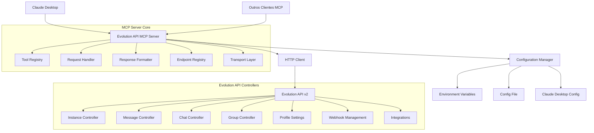

# Design Document

## Overview

Este documento descreve o design técnico para o servidor MCP (Model Context Protocol) da Evolution API v2. O servidor será implementado em TypeScript usando o MCP TypeScript SDK oficial, permitindo execução via npx e integração com a Evolution API através de requisições HTTP. O sistema fornecerá uma interface padronizada para todas as funcionalidades da Evolution API v2 baseada na documentação oficial, com suporte específico para integração com Claude Desktop e outros clientes MCP.

## Architecture

### High-Level Architecture



### Component Architecture

1. **MCP Server Core**: Implementação base usando MCP TypeScript SDK com suporte a STDIO transport
2. **HTTP Client**: Gerenciamento de requisições para Evolution API
3. **Configuration Manager**: Gerenciamento de configurações e credenciais (incluindo Claude Desktop)
4. **Tool Registry**: Registro de ferramentas MCP baseado nos endpoints da Evolution API v2
5. **Endpoint Registry**: Definições estáticas dos endpoints da Evolution API v2
6. **Transport Layer**: Suporte a STDIO para Claude Desktop e HTTP para outros clientes
7. **Request/Response Handlers**: Processamento e formatação de dados

## Components and Interfaces

### 1. MCP Server Core

```typescript
interface McpServerConfig {
  name: string;
  version: string;
  evolutionUrl: string;
  evolutionApiKey: string;
}

class EvolutionMcpServer {
  private server: McpServer;
  private httpClient: EvolutionHttpClient;
  private toolRegistry: ToolRegistry;
  private endpointRegistry: EndpointRegistry;
  
  constructor(config: McpServerConfig);
  async initialize(): Promise<void>;
  async registerTools(): Promise<void>;
  async connectStdio(): Promise<void>; // Para Claude Desktop
  async connectHttp(port: number): Promise<void>; // Para outros clientes
  async connect(transport: Transport): Promise<void>; // Genérico
}
```

### 2. Endpoint Registry

```typescript
interface EndpointRegistry {
  getEndpoints(): EndpointInfo[];
  getEndpointsByController(controller: string): EndpointInfo[];
  getEndpoint(name: string): EndpointInfo | undefined;
}

interface EndpointInfo {
  name: string;
  path: string;
  method: string;
  description: string;
  parameters: Parameter[];
  controller: string;
  requiresInstance: boolean;
  schema: z.ZodSchema;
}

interface Parameter {
  name: string;
  type: string;
  required: boolean;
  description: string;
  location: 'path' | 'query' | 'body' | 'header';
}
```

### 3. HTTP Client

```typescript
interface EvolutionHttpClient {
  request<T>(options: RequestOptions): Promise<ApiResponse<T>>;
  get<T>(path: string, params?: Record<string, any>): Promise<ApiResponse<T>>;
  post<T>(path: string, data?: any, params?: Record<string, any>): Promise<ApiResponse<T>>;
  put<T>(path: string, data?: any, params?: Record<string, any>): Promise<ApiResponse<T>>;
  delete<T>(path: string, params?: Record<string, any>): Promise<ApiResponse<T>>;
}

interface RequestOptions {
  method: string;
  path: string;
  data?: any;
  params?: Record<string, any>;
  headers?: Record<string, string>;
}

interface ApiResponse<T> {
  success: boolean;
  data?: T;
  error?: ApiError;
  statusCode: number;
}
```

### 4. Tool Registry

```typescript
interface ToolRegistry {
  registerTool(toolInfo: ToolInfo): void;
  getTools(): ToolInfo[];
  updateTool(name: string, updates: Partial<ToolInfo>): void;
  removeTool(name: string): void;
}

interface ToolInfo {
  name: string;
  description: string;
  controller: string;
  endpoint: EndpointInfo;
  schema: z.ZodSchema;
  handler: ToolHandler;
}

type ToolHandler = (params: any) => Promise<ToolResult>;
```

### 5. Configuration Manager

```typescript
interface ConfigurationManager {
  loadConfig(): Promise<McpServerConfig>;
  validateConfig(config: McpServerConfig): Promise<boolean>;
  watchConfig(callback: (config: McpServerConfig) => void): void;
}

interface ConfigSource {
  type: 'environment' | 'file';
  priority: number;
  load(): Promise<Partial<McpServerConfig>>;
}
```

## Data Models

### Evolution API Models

```typescript
// Instance Models
interface Instance {
  instanceName: string;
  status: 'open' | 'close' | 'connecting';
  serverUrl: string;
  apikey: string;
}

// Message Models
interface TextMessage {
  number: string;
  text: string;
  delay?: number;
  quoted?: MessageQuoted;
}

interface MediaMessage {
  number: string;
  media: string; // URL or base64
  caption?: string;
  fileName?: string;
  delay?: number;
}

// Group Models
interface GroupInfo {
  id: string;
  subject: string;
  description?: string;
  participants: Participant[];
  admins: string[];
}

// Webhook Models
interface WebhookConfig {
  enabled: boolean;
  url: string;
  events: string[];
}
```

### MCP Tool Schemas

```typescript
// Instance Controller Tools
const createInstanceSchema = z.object({
  instanceName: z.string(),
  token: z.string().optional(),
  qrcode: z.boolean().optional(),
  webhook: z.string().optional()
});

const sendTextSchema = z.object({
  instance: z.string(),
  number: z.string(),
  text: z.string(),
  delay: z.number().optional()
});

const sendMediaSchema = z.object({
  instance: z.string(),
  number: z.string(),
  media: z.string(),
  caption: z.string().optional(),
  fileName: z.string().optional()
});

// Group Controller Tools
const createGroupSchema = z.object({
  instance: z.string(),
  subject: z.string(),
  description: z.string().optional(),
  participants: z.array(z.string())
});

// Chat Controller Tools
const findMessagesSchema = z.object({
  instance: z.string(),
  where: z.object({
    key: z.object({
      remoteJid: z.string().optional()
    }).optional()
  }).optional(),
  limit: z.number().optional()
});
```

## Error Handling

### Error Types

```typescript
enum ErrorType {
  CONFIGURATION_ERROR = 'CONFIGURATION_ERROR',
  AUTHENTICATION_ERROR = 'AUTHENTICATION_ERROR',
  API_ERROR = 'API_ERROR',
  NETWORK_ERROR = 'NETWORK_ERROR',
  VALIDATION_ERROR = 'VALIDATION_ERROR',
  TIMEOUT_ERROR = 'TIMEOUT_ERROR'
}

interface McpError {
  type: ErrorType;
  message: string;
  code?: string;
  statusCode?: number;
  details?: any;
}
```

### Error Handling Strategy

1. **Configuration Errors**: Validação na inicialização com mensagens claras
2. **Authentication Errors**: Retry automático com backoff exponencial
3. **API Errors**: Mapeamento de códigos HTTP para mensagens específicas
4. **Network Errors**: Retry com timeout configurável
5. **Validation Errors**: Validação de parâmetros com Zod schemas

### Error Response Format

```typescript
interface ErrorResponse {
  success: false;
  error: {
    type: ErrorType;
    message: string;
    code?: string;
    suggestions?: string[];
  };
}
```

## Testing Strategy

### Unit Tests

1. **Configuration Manager**: Testes de carregamento e validação de configuração
2. **HTTP Client**: Mocks de requisições e tratamento de erros
3. **Tool Registry**: Registro, atualização e remoção de ferramentas
4. **Context7 Integration**: Descoberta de endpoints e parsing de documentação

### Integration Tests

1. **Evolution API Integration**: Testes com instância real da Evolution API
2. **MCP Protocol**: Testes de comunicação MCP completa
3. **Context7 Integration**: Testes de descoberta de endpoints reais

### End-to-End Tests

1. **NPX Execution**: Testes de execução via npx
2. **Full Workflow**: Criação de instância, envio de mensagem, webhook
3. **Error Scenarios**: Testes de cenários de erro e recuperação

### Test Structure

```typescript
describe('EvolutionMcpServer', () => {
  describe('Configuration', () => {
    it('should load configuration from environment variables');
    it('should validate Evolution API credentials');
    it('should handle missing configuration gracefully');
  });

  describe('Endpoint Registry', () => {
    it('should provide all Evolution API v2 endpoints');
    it('should filter endpoints by controller');
    it('should validate endpoint schemas');
  });

  describe('Tool Registration', () => {
    it('should register tools for all controllers');
    it('should validate tool schemas');
    it('should handle dynamic tool updates');
  });

  describe('HTTP Client', () => {
    it('should make authenticated requests');
    it('should handle API errors properly');
    it('should retry on network failures');
  });
});
```

## Implementation Details

### NPX Package Structure

```
evolution-api-mcp/
├── package.json
├── bin/
│   └── evolution-api-mcp.js
├── src/
│   ├── index.ts
│   ├── server/
│   │   ├── mcp-server.ts
│   │   ├── tool-registry.ts
│   │   └── request-handlers.ts
│   ├── clients/
│   │   └── evolution-http-client.ts
│   ├── config/
│   │   ├── configuration-manager.ts
│   │   └── schemas.ts
│   ├── registry/
│   │   └── endpoint-registry.ts
│   ├── tools/
│   │   ├── instance-tools.ts
│   │   ├── message-tools.ts
│   │   ├── chat-tools.ts
│   │   ├── group-tools.ts
│   │   ├── profile-tools.ts
│   │   └── webhook-tools.ts
│   └── utils/
│       ├── error-handler.ts
│       └── validators.ts
├── tests/
└── README.md
```

### Package.json Configuration

```json
{
  "name": "evolution-api-mcp",
  "version": "1.0.0",
  "description": "MCP Server for Evolution API v2",
  "bin": {
    "evolution-api-mcp": "./bin/evolution-api-mcp.js"
  },
  "main": "./dist/index.js",
  "scripts": {
    "build": "tsc",
    "start": "node ./dist/index.js",
    "dev": "tsx ./src/index.ts",
    "test": "jest"
  },
  "dependencies": {
    "@modelcontextprotocol/sdk": "^1.0.0",
    "zod": "^3.22.0",
    "axios": "^1.6.0",
    "dotenv": "^16.3.0"
  },
  "devDependencies": {
    "typescript": "^5.0.0",
    "tsx": "^4.0.0",
    "jest": "^29.0.0",
    "@types/node": "^20.0.0"
  }
}
```

### Environment Variables

```bash
# Required
EVOLUTION_URL=https://your-evolution-api.com
EVOLUTION_API_KEY=your-global-api-key

# Optional
MCP_SERVER_NAME=evolution-api-mcp
MCP_SERVER_VERSION=1.0.0
HTTP_TIMEOUT=30000
RETRY_ATTEMPTS=3
RETRY_DELAY=1000
```

### Configuration File Support

```json
{
  "evolutionUrl": "https://your-evolution-api.com",
  "evolutionApiKey": "your-global-api-key",
  "server": {
    "name": "evolution-api-mcp",
    "version": "1.0.0"
  },
  "http": {
    "timeout": 30000,
    "retryAttempts": 3,
    "retryDelay": 1000
  }
}
```

## Security Considerations

1. **API Key Management**: Armazenamento seguro de credenciais
2. **Input Validation**: Validação rigorosa de todos os parâmetros
3. **Rate Limiting**: Implementação de rate limiting para evitar abuse
4. **Error Information**: Não exposição de informações sensíveis em erros
5. **HTTPS Only**: Requisições apenas via HTTPS
6. **Timeout Configuration**: Timeouts apropriados para evitar hanging requests

## Performance Considerations

1. **Connection Pooling**: Reutilização de conexões HTTP
2. **Caching**: Cache de descoberta de endpoints e documentação
3. **Lazy Loading**: Carregamento sob demanda de ferramentas
4. **Memory Management**: Limpeza adequada de recursos
5. **Async Operations**: Operações assíncronas para melhor performance

## Claude Desktop Integration

### MCP Configuration for Claude Desktop

O servidor será configurado no Claude Desktop através do arquivo de configuração MCP:

```json
{
  "mcpServers": {
    "evolution-api": {
      "command": "npx",
      "args": ["evolution-api-mcp"],
      "env": {
        "EVOLUTION_URL": "https://your-evolution-api.com",
        "EVOLUTION_API_KEY": "your-global-api-key"
      }
    }
  }
}
```

### STDIO Transport Implementation

```typescript
import { StdioServerTransport } from "@modelcontextprotocol/sdk/server/stdio.js";

class EvolutionMcpServer {
  async startForClaudeDesktop(): Promise<void> {
    const transport = new StdioServerTransport();
    await this.server.connect(transport);
    
    // Keep the process alive
    process.on('SIGINT', () => {
      console.log('Shutting down Evolution API MCP Server...');
      process.exit(0);
    });
  }
}
```

### Tool Descriptions for Claude

As ferramentas serão descritas de forma clara para o Claude Desktop:

```typescript
// Exemplo de ferramenta otimizada para Claude
server.tool(
  "evolution_send_text_message",
  {
    instance: z.string().describe("Nome da instância do WhatsApp"),
    number: z.string().describe("Número do destinatário (formato: 5511999999999)"),
    text: z.string().describe("Texto da mensagem a ser enviada"),
    delay: z.number().optional().describe("Delay em milissegundos antes de enviar")
  },
  async ({ instance, number, text, delay }) => {
    // Implementação da ferramenta
    const result = await this.httpClient.post(`/message/sendText/${instance}`, {
      number,
      text,
      delay
    });
    
    return {
      content: [{
        type: "text",
        text: `Mensagem enviada com sucesso para ${number}: "${text}"`
      }]
    };
  }
);
```

### Error Handling for Claude Desktop

```typescript
interface ClaudeOptimizedError {
  success: false;
  error: {
    message: string;
    suggestion: string;
    code?: string;
  };
}

// Exemplo de tratamento de erro otimizado para Claude
const handleEvolutionApiError = (error: any): ClaudeOptimizedError => {
  if (error.response?.status === 401) {
    return {
      success: false,
      error: {
        message: "Falha na autenticação com a Evolution API",
        suggestion: "Verifique se a EVOLUTION_API_KEY está correta e válida",
        code: "AUTH_ERROR"
      }
    };
  }
  
  if (error.response?.status === 404) {
    return {
      success: false,
      error: {
        message: "Instância não encontrada",
        suggestion: "Verifique se o nome da instância está correto e se ela existe",
        code: "INSTANCE_NOT_FOUND"
      }
    };
  }
  
  return {
    success: false,
    error: {
      message: error.message || "Erro desconhecido",
      suggestion: "Tente novamente ou verifique os logs para mais detalhes"
    }
  };
};
```

## Deployment and Distribution

### NPX Distribution

1. **Package Registry**: Publicação no npm registry
2. **Versioning**: Semantic versioning para releases
3. **Documentation**: README completo com exemplos
4. **CI/CD**: Pipeline automatizado para build e deploy

### Usage Examples

```bash
# Execução básica (STDIO para Claude Desktop)
npx evolution-api-mcp

# Com configuração via variáveis de ambiente
EVOLUTION_URL=https://api.example.com EVOLUTION_API_KEY=key123 npx evolution-api-mcp

# Com arquivo de configuração
npx evolution-api-mcp --config ./evolution-config.json

# Modo HTTP para outros clientes MCP
npx evolution-api-mcp --http --port 3000
```

### Claude Desktop Setup Guide

1. **Instalar o pacote globalmente (opcional)**:
```bash
npm install -g evolution-api-mcp
```

2. **Configurar no Claude Desktop** (`~/.claude/mcp.json`):
```json
{
  "mcpServers": {
    "evolution-api": {
      "command": "npx",
      "args": ["evolution-api-mcp"],
      "env": {
        "EVOLUTION_URL": "https://your-evolution-api.com",
        "EVOLUTION_API_KEY": "your-global-api-key"
      }
    }
  }
}
```

3. **Reiniciar o Claude Desktop** para carregar a nova configuração

4. **Testar a integração** perguntando ao Claude:
   - "Quais instâncias do WhatsApp estão disponíveis?"
   - "Envie uma mensagem de teste para o número +55 11 99999-9999"
   - "Crie uma nova instância chamada 'teste'"